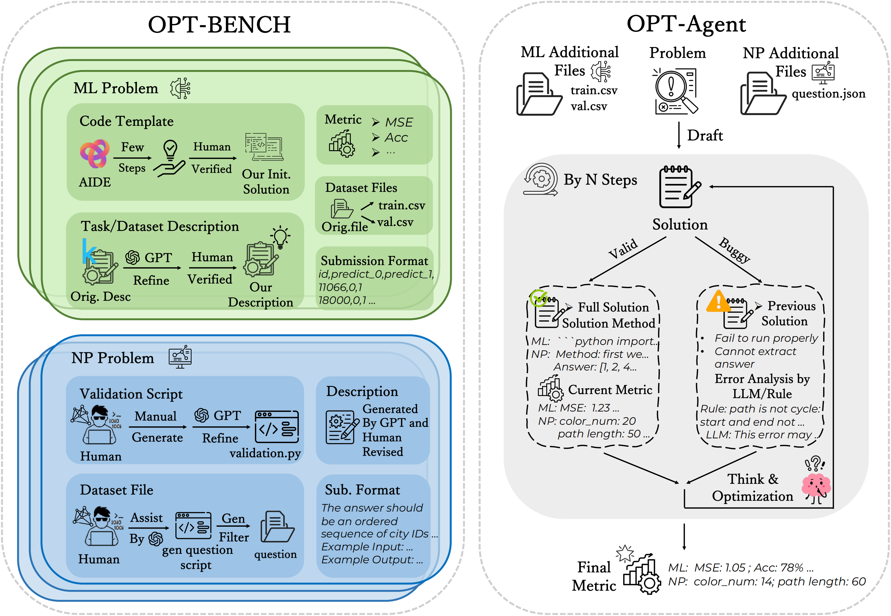
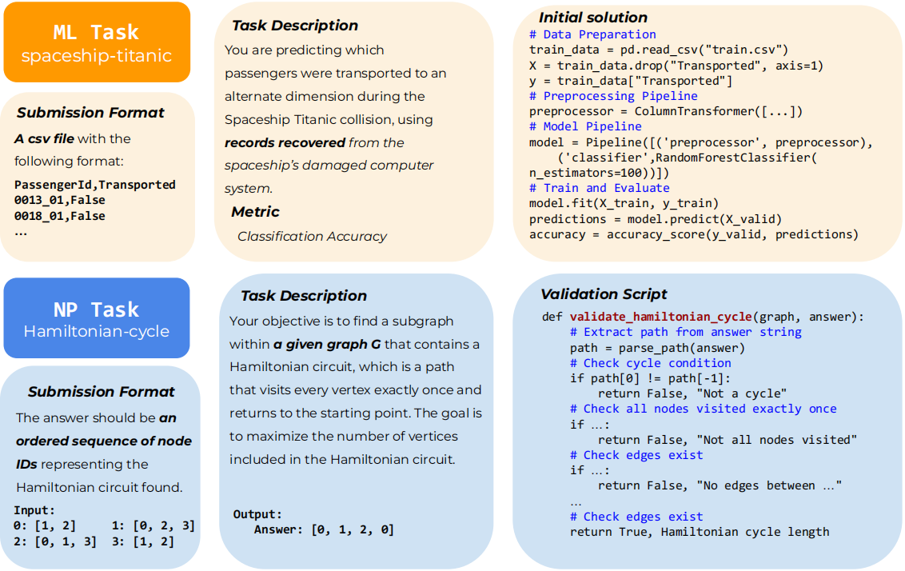
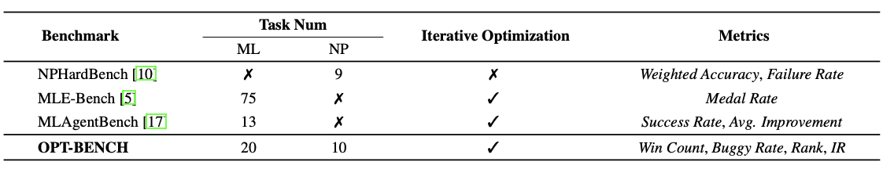
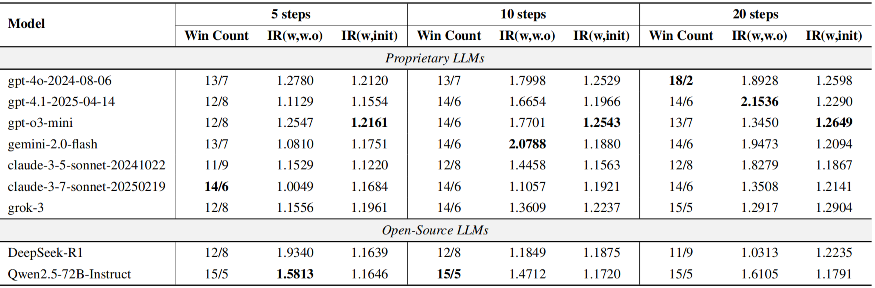
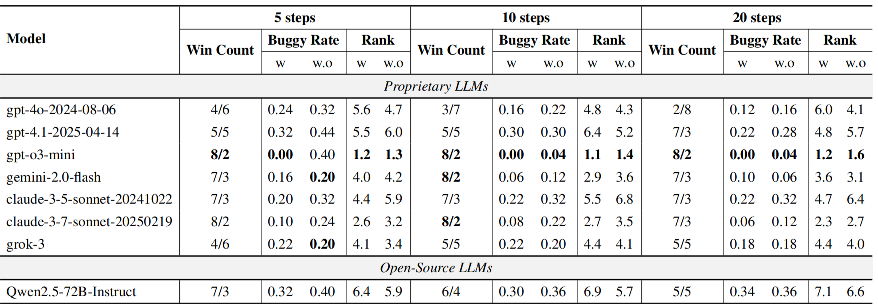
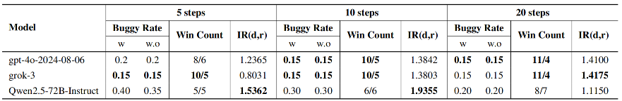

# OPT-BENCH: Evaluating LLM Agent on Large-Scale
<div align="center">

[📃[Paper](http://arxiv.org/abs/2506.10764)]
[🌐[Project Page](https://github.com/OliverLeeXZ/OPT-BENCH)]
[🤗[Hugging Face](https://huggingface.co/datasets/OPT-Bench/OPT-Bench)]
</div>


## 📣 What's New
- **[2025.6.11]** We have released data in [OliverLeeXZ/OPT-Bench](https://huggingface.co/datasets/OPT-Bench/OPT-Bench). 🎉🎉🎉
- **[2025.6.10]** We have released code in [OliverLeeXZ/OPT-Bench](https://github.com/OliverLeeXZ/OPT-BENCH). 🎉🎉🎉
- **[2025.6.10]** Our OPT-BENCH Paper is released! Check it at 📃[Arxiv: OPT-BENCH](http://arxiv.org/abs/2506.10764) ! Our Dataset will be open-sourced soon! 🎉🎉🎉

## 🌟 Highlights
<div align="center">
 
</div>

1. We present OPT-BENCH, a benchmark comprising 20 machine learning tasks and 10 NP problems,
specifically designed to assess large language models’ (LLMs) ability to solve problems with large
search spaces. It evaluates whether models can improve solutions over time by learning from past
feedback.
2. We introduce OPT-Agent, an end-to-end automated evaluation framework that enables LLMs to
learn from historical feedback when solving practical, real-world optimization problems, thereby
advancing their cognitive capabilities in iterative reasoning and improvement.
3. We perform extensive experiments on 9 state-of-the-art LLMs from 6 different model families. Our
analysis provides insights that can help guide future research on enhancing LLMs’ optimization
capabilities

## 📚 Dataset Statistics
<div align="center">
 
</div>


<div align="center">
 
</div>

## 🏆 OPT-BENCH Leaderboard
Performance of existing MLLMs on OPT-BENCH. We use four metrics to evaluate LLM performance on ML and NP tasks in OPT-BENCH, including Win Count, Buggy Rate, Rank, and Improvement Rate, which assess optimization capability, model robustness, ranking, and optimization performance across different experimental settings.

<div align="center">
 
</div>
Evaluation Results of LLMs on OPT-BENCH-ML. The column Win Count denotes the win count comparing the performance of LLM optimization using OPT-Agent against the baseline without historical information; IR(w,w.o) represents the improvement rate of OPT-Agent relative to the baseline; and IR(w,init) indicates the improvement relative to the initial solution. Evaluation Results of LLMs on OPT-BENCH-ML.
<div align="center">
 
</div>
Evaluation Results of LLMs on OPT-BENCH-NP. The column Win Count denotes the win count comparing performance of LLM optimization using OPT-Agent against the baseline without historical information; Buggy Rate indicates the proportion of tasks where the model fails to produce a valid solution; Rank reflects the relative ranking of the model’s optimization outcomes per task.
<div align="center">
 
</div>
Evaluation Results of LLMs under Draft Settings. Metrics include Buggy Rate, denoting the proportion of invalid solutions; Win Count, comparing OPT-Agent-draft optimization against the baseline without historical information; and IR(d,r), the improvement rate comparing OPT-Agent-draft optimization to OPT-Agent-refine.
# OPT-BENCH

## Setup
Make sure you have ```Python>=3.10``` installed and run:
```
pip install -r requirements.txt
```

## Inference Example

### API Model
```
export API_KEY="Your api key"
export BASE_URL="Your api URL"
```
### Open-sourced Model

We recommend that deploy model using lmdeploy.
```
export export API_KEY=EMPTY
export BASE_URL="Your model URL"
```
### For ML task
```
cd OPT-BENCH
python run_exp.py --data_dir OPTAgent/example_tasks/spaceship-titanic --steps 1 --base_model gpt-4o-2024-08-06
```

### For NP task 
```
python run_exp.py --data_dir OPTAgent/example_tasks/hamiltonian-cycle --task_field NP --steps <your steps default is 10> --base_model <your model default is 4o>
```

## For task scale up
```
https://huggingface.co/datasets/OPT-Bench/OPT-Bench
```
### For NP task
Take ```OPTAgent/example_tasks/hamiltonian-cycle``` as the example.
1. Add your date in ```OPTAgent/example_tasks``` dir.
2. Prepare your own task. ``` task description in ## Description section, metric in ## Metric, submission format in ## Submission Format ```.
3. Prepare ``` question.json```. Your question should in ```"question"``` formatted as dict.
4. prepare ```validation.py```. The rule-based validation py script for your task.

Run the ```run_exp.py``` for validation.

### For ML task
Take ```OPTAgent/example_tasks/spaceship-titanic``` as the example.
1. Add your date in ```OPTAgent/example_tasks``` dir.
2. Prepare your own task. ``` task description in ## Description section, metric in ## Metric, dataset description in ## Dataset Description, submission format in ## Submission Format ```.
3. You should prepare ```init.py in ## Code Template``` for ```OPTAgent-refine```, which is optional for ```OPTAgent-draft```.


## 🖊️ Citation

If you find this work helpful, please consider to **star🌟** this repo. Thanks for your support!

```bib
@misc{li2025optbenchevaluatingllmagent,
      title={OPT-BENCH: Evaluating LLM Agent on Large-Scale Search Spaces Optimization Problems}, 
      author={Xiaozhe Li and Jixuan Chen and Xinyu Fang and Shengyuan Ding and Haodong Duan and Qingwen Liu and Kai Chen},
      year={2025},
      eprint={2506.10764},
      archivePrefix={arXiv},
      primaryClass={cs.AI},
      url={https://arxiv.org/abs/2506.10764}, 
}
```

<picture>
  <source
    media="(prefers-color-scheme: dark)"
    srcset="
      https://api.star-history.com/svg?repos=OliverLeeXZ/OPT-BENCH&type=Date&theme=dark
    "
  />
  <source
    media="(prefers-color-scheme: light)"
    srcset="
      https://api.star-history.com/svg?repos=OliverLeeXZ/OPT-BENCH&type=Date
    "
  />
  
</picture>